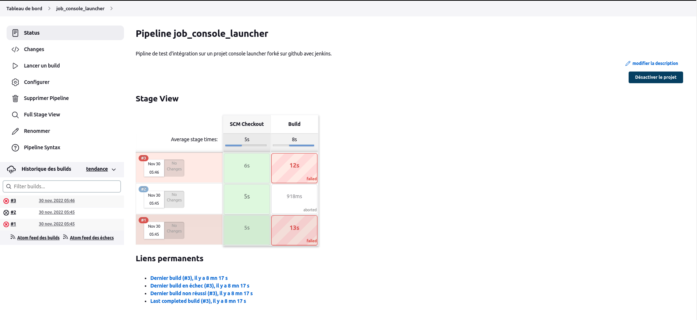

## Prise en Main d'un projet Jenkins

### pré-requis:

* jenkins
* git jenkins
* git 
* github
* linux 

## Fork github project 

fork dans github le projet [ConsoleLuncher](https://github.com/MohamedHammouda/ConsoleLuncher)
```
https://github.com/MohamedHammouda/ConsoleLuncher

```
## Jenkins plateforme  
Démarrer jenkins et s'authentifier en tant que administrateur.
```
sudo service jenkins start
```
Dashbord > `new item`
 * Préciser le nom du job
 * Choisir PipeLine en tant que job
 * Sauvegarder
  
Définir votre pipeline script (slide suivant)
```
    node{
    
    stage('SCM Checkout'){
        git url: 'https://github.com/lmlouis/ConsoleLuncherProject_jenkins.git',branch: 'master'
    }
    stage('Build'){
        sh 'mkdir -p lib'
        sh 'pwd'
        sh 'curl -o "lib/junit-platform-console-standalone-1.8.1.jar" "https://repo1.maven.org/maven2/org/junit/platform/junit-platform-console-standalone/1.8.1/junit-platform-console-standalone-1.8.1.jar"'
        sh 'javac -d target -cp "lib/junit-platform-console-standalone-1.8.1.jar" src/test/java/com/FirstTes.java'
    }
    stage('Test'){
        sh 'java -jar "lib/junit-platform-console-standalone-1.8.1.jar" -cp target -c FirstTes'
    }
}

```

* Sauvegarder
* Build now

le résultat du test 
